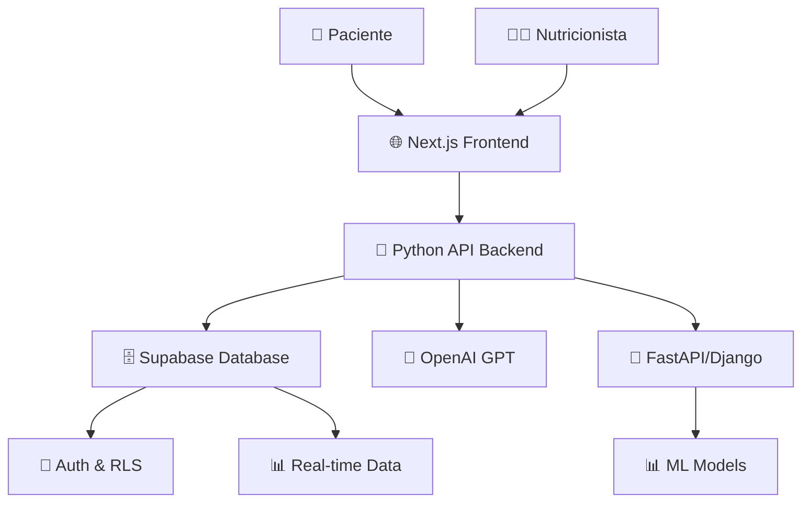
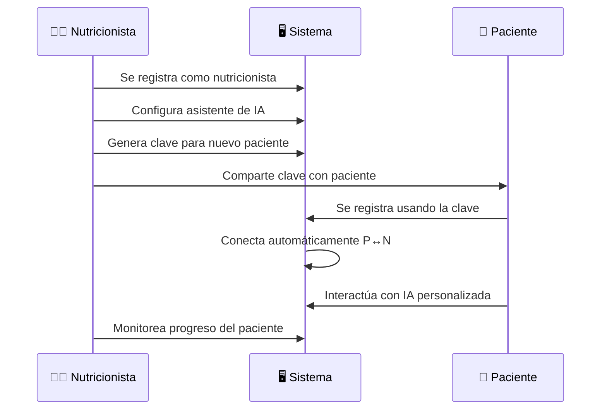

# 🥗 NutriGuide

<div align="center">


**La plataforma de nutrición inteligente que conecta nutricionistas con sus pacientes**

[](https://nextjs.org/)
[](https://www.typescriptlang.org/)
[](https://supabase.com/)
[](https://tailwindcss.com/)

[🚀 Demo](#demo) • [✨ Características](#características) • [🛠️ Instalación](#instalación) • [📖 Uso](#uso) • [🤝 Contribuir](#contribuir)

</div>

---

## 🌟 ¿Qué es NutriGuide?

NutriGuide es una plataforma revolucionaria que **transforma la relación entre nutricionistas y pacientes** mediante tecnología de inteligencia artificial. Permite a los profesionales de la nutrición extender su cuidado más allá de las consultas presenciales, brindando soporte continuo y personalizado a sus pacientes.

### 🎯 El Problema que Resolvemos

- **Nutricionistas**: Limitados a consultas presenciales, sin herramientas para seguimiento continuo
- **Pacientes**: Necesitan orientación constante entre consultas, dudas diarias sobre alimentación
- **Desconexión**: Falta de comunicación y seguimiento entre citas

### 💡 Nuestra Solución

NutriGuide crea un **ecosistema digital conectado** donde:
- Los nutricionistas pueden configurar asistentes de IA con su filosofía única
- Los pacientes reciben orientación 24/7 alineada con su plan personalizado
- El seguimiento del progreso es continuo y transparente

---

## ✨ Características

### 👨‍⚕️ Para Nutricionistas

<table>
<tr>
<td width="50%">

#### 🔑 **Sistema de Claves Únicas**
- Genera claves individuales para cada nuevo paciente
- Control total sobre quién puede unirse a tu práctica
- Trazabilidad completa de registros

#### 🤖 **Asistente de IA Personalizable**
- Configura la IA con tu filosofía dietética
- Define directrices y estilo de respuesta
- Mantén tu enfoque profesional único

</td>
<td width="50%">

#### 📊 **Panel de Control Avanzado**
- Monitorea el progreso de todos tus pacientes
- Visualiza estadísticas de engagement
- Gestiona tu práctica de forma eficiente

#### 🔗 **Integración Fluida**
- Conecta automáticamente con nuevos pacientes
- Sistema de invitaciones sin complicaciones
- Onboarding guiado para pacientes

</td>
</tr>
</table>

### 👤 Para Pacientes

<table>
<tr>
<td width="50%">

#### 🍽️ **Planificación de Comidas**
- Planes personalizados según tus objetivos
- Recetas adaptadas a tus restricciones
- Seguimiento nutricional detallado

#### 💬 **Orientación con IA 24/7**
- Asistente disponible todo el día
- Respuestas alineadas con tu nutricionista
- Soporte continuo entre consultas

</td>
<td width="50%">

#### 📈 **Seguimiento de Progreso**
- Registro diario de comidas y actividad
- Gráficos de evolución y logros
- Metas personalizadas y alcanzables

#### 🎯 **Experiencia Personalizada**
- Interfaz adaptada a tus necesidades
- Notificaciones inteligentes
- Gamificación del proceso

</td>
</tr>
</table>

---

## 🛠️ Tech Stack

<div align="center">

| Frontend | Backend | Database | AI/ML | Styling |
|----------|---------|----------|-------|---------|
|  |  |  |  |  |

</div>

### 🏗️ Arquitectura



---

## 🚀 Instalación

### Prerrequisitos

- Node.js 18+ (para el frontend)
- Python 3.8+ (para el backend)
- npm o yarn
- pip o poetry (para dependencias de Python)
- Cuenta de Supabase
- API Key de OpenAI (opcional)

### Configuración Rápida

```bash
# 1. Clonar el repositorio
git clone https://github.com/tu-usuario/nutriguide.git
cd nutriguide

# 2. Configurar Frontend (Next.js)
npm install

# 3. Configurar Backend (Python)
cd backend
pip install -r requirements.txt
# o si usas poetry:
# poetry install

# 4. Configurar variables de entorno
cp .env.example .env.local
# Edita .env.local con tus credenciales

# 5. Configurar la base de datos
npx supabase migration up

# 6. Ejecutar en desarrollo
# Terminal 1 - Frontend
npm run dev

# Terminal 2 - Backend
cd backend
python main.py
# o
# uvicorn main:app --reload (si usas FastAPI)
```

### 🔧 Variables de Entorno

```env
# Supabase
NEXT_PUBLIC_SUPABASE_URL=tu_supabase_url
NEXT_PUBLIC_SUPABASE_ANON_KEY=tu_anon_key
SUPABASE_SERVICE_ROLE_KEY=tu_service_role_key

# OpenAI (opcional)
OPENAI_API_KEY=tu_openai_key

# Frontend (Next.js)
NEXTAUTH_SECRET=tu_nextauth_secret
NEXTAUTH_URL=http://localhost:3000

# Backend (Python)
PYTHON_API_URL=http://localhost:8000
DATABASE_URL=postgresql://...
SECRET_KEY=tu_secret_key_python
DEBUG=True
CORS_ORIGINS=http://localhost:3000
```

---

## 📖 Uso

### 🔄 Flujo de Trabajo



### 👨‍⚕️ Para Nutricionistas

1. **Registro**: Crea tu cuenta profesional
2. **Configuración**: Define tu filosofía y directrices de IA
3. **Invitar Pacientes**: Genera claves únicas desde tu dashboard
4. **Monitoreo**: Supervisa el progreso desde el panel de control

### 👤 Para Pacientes

1. **Registro**: Usa la clave proporcionada por tu nutricionista
2. **Perfil**: Completa tu información de salud y objetivos
3. **Planificación**: Accede a tu plan de comidas personalizado
4. **Seguimiento**: Registra tu progreso diario

---

## 🎨 Capturas de Pantalla

<div align="center">

### 🏠 Dashboard del Nutricionista
*Gestiona tus pacientes y genera claves de acceso*


### 📊 Panel del Paciente
*Seguimiento personalizado y plan nutricional*


### 🤖 Chat con IA
*Orientación nutricional 24/7*


</div>

---

## 🔐 Seguridad y Privacidad

- **🔒 Autenticación Segura**: Supabase Auth con RLS
- **🛡️ Datos Protegidos**: Encriptación end-to-end
- **👥 Aislamiento**: Cada nutricionista ve solo sus pacientes
- **🔑 Claves Únicas**: Sistema de invitación controlado
- **📋 Cumplimiento**: GDPR y regulaciones de salud

---

## 🗺️ Roadmap

- [x] 🔑 Sistema de claves únicas
- [x] 👥 Dashboard multi-rol
- [x] 🤖 Integración con IA
- [ ] 📱 App móvil nativa
- [ ] 📊 Analytics avanzados
- [ ] 🔗 Integraciones con wearables
- [ ] 🌍 Soporte multi-idioma
- [ ] 📈 Reportes automáticos

---

## 🤝 Contribuir

¡Nos encanta recibir contribuciones! Aquí te explicamos cómo puedes ayudar:

### 🐛 Reportar Bugs

1. Busca si el issue ya existe
2. Crea un nuevo issue con detalles
3. Incluye pasos para reproducir

### 💡 Proponer Features

1. Abre un issue de "feature request"
2. Describe el problema que resuelve
3. Propón una solución

### 🔧 Desarrollo

```bash
# 1. Fork del repositorio
# 2. Crear branch para tu feature
git checkout -b feature/nueva-funcionalidad

# 3. Hacer commits descriptivos
git commit -m "feat: añadir sistema de notificaciones"

# 4. Push a tu fork
git push origin feature/nueva-funcionalidad

# 5. Crear Pull Request
```

### 📝 Convenciones

- **Commits**: Seguimos [Conventional Commits](https://www.conventionalcommits.org/)
- **Código**: ESLint + Prettier configurados
- **Testing**: Jest + Testing Library

---

## 📄 Licencia

Este proyecto está bajo la licencia MIT. Ver [LICENSE](LICENSE) para más detalles.

---

## 🙏 Agradecimientos

- **🎨 Diseño**: Inspirado en principios de diseño centrado en el usuario
- **🔧 Tecnología**: Basado en los ecosistemas modernos de JavaScript y Python
- **👥 Comunidad**: Feedback invaluable de nutricionistas y pacientes
- **🐍 Python**: Por su excelente ecosistema de IA y machine learning
- **⚛️ React/Next.js**: Por facilitar una UI moderna y reactiva

---

<div align="center">

**¿Te gusta NutriGuide? ¡Dale una ⭐ en GitHub!**

[](https://github.com/tu-usuario/nutriguide/stargazers)
[](https://github.com/tu-usuario/nutriguide/network/members)

**Desarrollado con ❤️ para revolucionar la nutrición personalizada**

[🌐 Website](https://nutriguide.com) • [📧 Contacto](mailto:hello@nutriguide.com) • [🐦 Twitter](https://twitter.com/nutriguide)

</div>
